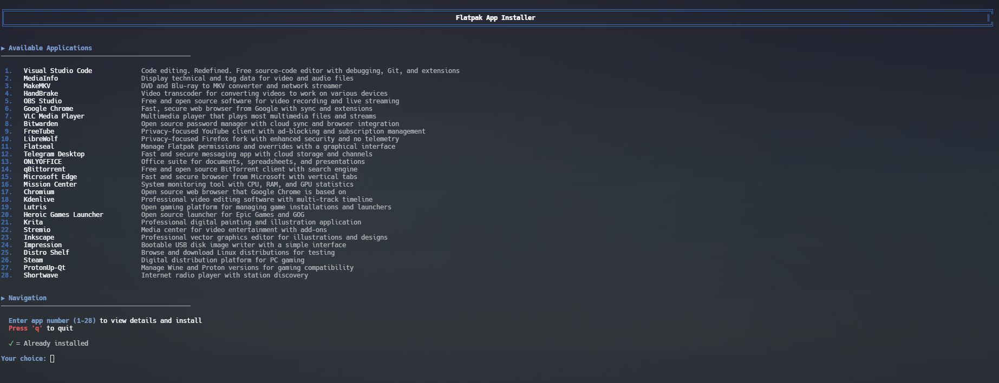

# flatpak-installer.sh

[⬆️ Back to Main](../README.md)

A curated Flatpak application installer featuring 28 popular applications with detailed descriptions and easy installation process.

---

## 📥 Quick Download

```bash
wget https://raw.githubusercontent.com/techytim-tech/Linux-Scripts/main/flatpak-installer.sh
chmod +x flatpak-installer.sh
./flatpak-installer.sh
```

---

---

## 📸 Screenshot

Click to view full size:

[](../screenshots/flatpak-installer-screenshot.png)

*The script showing Apps from flatpak Installer*

---

## ✨ Features

- **28 Curated Applications** - Carefully selected popular apps across different categories
- **Beautiful Fedora Theme** - Clean, professional interface with Fedora's signature blue colors
- **Detailed Descriptions** - Each app includes a summary explaining what it does
- **Installation Status** - Shows which apps are already installed with ✓ indicator
- **Smart Management** - Installed apps can be reinstalled or uninstalled
- **Interactive Navigation** - Simple number-based selection system
- **Live Progress Display** - Real-time installation progress with colored output
- **Prerequisites Check** - Verifies Flatpak and Flathub are set up before starting
- **Persistent Interface** - Returns to main list after each operation

---

## 📱 Available Applications

### Development Tools
| # | Application | Description |
|---|-------------|-------------|
| 1 | **Visual Studio Code** | Code editing with debugging, Git, and extensions |

### Media & Video
| # | Application | Description |
|---|-------------|-------------|
| 2 | **MediaInfo** | Display technical and tag data for video/audio files |
| 3 | **MakeMKV** | DVD and Blu-ray to MKV converter |
| 4 | **HandBrake** | Video transcoder for various devices |
| 5 | **OBS Studio** | Video recording and live streaming software |
| 7 | **VLC Media Player** | Universal multimedia player |
| 18 | **Kdenlive** | Professional video editing software |
| 28 | **Shortwave** | Internet radio player |

### Web Browsers
| # | Application | Description |
|---|-------------|-------------|
| 6 | **Google Chrome** | Fast, secure browser with sync |
| 9 | **FreeTube** | Privacy-focused YouTube client |
| 10 | **LibreWolf** | Privacy-focused Firefox fork |
| 15 | **Microsoft Edge** | Browser with vertical tabs |
| 17 | **Chromium** | Open source browser base for Chrome |

### Productivity
| # | Application | Description |
|---|-------------|-------------|
| 8 | **Bitwarden** | Open source password manager |
| 12 | **Telegram Desktop** | Fast and secure messaging app |
| 13 | **ONLYOFFICE** | Office suite for documents and spreadsheets |

### System Utilities
| # | Application | Description |
|---|-------------|-------------|
| 11 | **Flatseal** | Manage Flatpak permissions graphically |
| 14 | **qBittorrent** | Free BitTorrent client |
| 16 | **Mission Center** | System monitoring with CPU/RAM/GPU stats |
| 24 | **Impression** | Bootable USB disk image writer |
| 25 | **Distro Shelf** | Browse and download Linux distributions |

### Gaming
| # | Application | Description |
|---|-------------|-------------|
| 19 | **Lutris** | Open gaming platform for managing games |
| 20 | **Heroic Games Launcher** | Launcher for Epic Games and GOG |
| 26 | **Steam** | Digital distribution platform for PC gaming |
| 27 | **ProtonUp-Qt** | Manage Wine and Proton versions |

### Creative & Design
| # | Application | Description |
|---|-------------|-------------|
| 21 | **Krita** | Professional digital painting application |
| 23 | **Inkscape** | Professional vector graphics editor |

### Entertainment
| # | Application | Description |
|---|-------------|-------------|
| 22 | **Stremio** | Media center for video entertainment |

---

## 🚀 Usage

### Installation

1. **Download the script:**
   ```bash
   wget https://raw.githubusercontent.com/techytim-tech/Linux-Scripts/main/flatpak-installer.sh
   ```

2. **Make it executable:**
   ```bash
   chmod +x flatpak-installer.sh
   ```

3. **Run the script:**
   ```bash
   ./flatpak-installer.sh
   ```

### Navigation

The script presents a numbered list of all 28 applications:

```
Available Applications

 1.   Visual Studio Code           Code editing. Redefined. Free source-code...
 2. ✓ MediaInfo                     Display technical and tag data for video...
 3.   MakeMKV                       DVD and Blu-ray to MKV converter...
...

Navigation

  Enter app number (1-28) to view details and install
  Press 'q' to quit

  ✓ = Already installed
```

**To use:**
- **Enter a number (1-28)** to view app details
- **Press 'q'** to quit the application

---

## 🔄 How It Works

### Main Interface

When you launch the script:

1. **Prerequisites Check**
   - Verifies Flatpak is installed
   - Verifies Flathub repository is added
   - Exits with helpful message if not set up

2. **App List Display**
   - Shows all 28 apps in a numbered list
   - Displays app name and description
   - Marks installed apps with ✓ indicator
   - Shows navigation instructions

3. **User Input**
   - Waits for number (1-28) or 'q'
   - Validates input
   - Shows error for invalid choices

### App Details View

When you select an app:

**For non-installed apps:**
```
App Details

Application: VLC Media Player
App ID: org.videolan.VLC
Description:
  Multimedia player that plays most multimedia files and streams

╔══════════════════════════════════════════════════════════════╗
║              Install this application?                       ║
╚══════════════════════════════════════════════════════════════╝

  [y] Press 'y' to INSTALL
  [b] Press 'b' to go BACK
```

**For installed apps:**
```
✓ This app is already installed

Actions Available:
  [r] Reinstall this app
  [u] Uninstall this app
  [b] Back to app list
```

### Installation Process

When you press 'y' to install:

1. **Download Phase**
   - Shows "Installing [App Name]"
   - Displays download progress
   - Shows package being installed

2. **Installation Phase**
   - Real-time progress updates
   - Color-coded output (orange for active operations)
   - Shows completion status

3. **Completion**
   - Success or error message
   - Instructions for launching the app
   - Prompts to return to app list

### Reinstall Process

When you press 'r' on an installed app:

1. Uninstalls current version
2. Re-downloads from Flathub
3. Installs fresh copy
4. Shows completion status

### Uninstall Process

When you press 'u' on an installed app:

1. Asks for confirmation (y/n)
2. Removes application
3. Shows completion status
4. Returns to app list

---

## 🎨 Visual Features

### Color Scheme (Fedora Theme)
- 🔵 **Fedora Blue** - Primary interface elements and borders
- ⚪ **White** - Main text and app names
- 🟢 **Green** - Success messages and install indicator (✓)
- 🔴 **Red** - App numbers and removal operations
- 🟡 **Yellow** - Confirmation prompts
- 🟠 **Orange** - Active installation progress
- 🔷 **Cyan** - Information messages
- ⚫ **Gray** - Descriptions and secondary text

### UI Elements
- **Numbered List** - Easy selection with numbers 1-28
- **Status Indicators** - Green ✓ for installed apps
- **Bordered Headers** - Professional section headers
- **Progress Display** - Live installation feedback
- **Color-Coded Actions** - Easy identification of operations

---

## 📋 Requirements

- **Flatpak installed** - Must be set up on your system
- **Flathub repository** - Must be added and configured
- **Internet connection** - Required to download apps
- **Bash shell** - Standard on all Linux distributions

**Note:** Use [flatpak-menu.sh](flatpak-menu.md) to set up Flatpak and Flathub if not already installed.

---

## 💡 Usage Examples

### Installing Your First App

```bash
# Launch the script
./flatpak-installer.sh

# Browse the list and choose an app (e.g., VLC is #7)
7

# Read the app details
# Press 'y' to install
y

# Wait for installation to complete
# Press any key to return to the list
```

### Reinstalling an App

```bash
# Launch the script
./flatpak-installer.sh

# Select an installed app (marked with ✓)
# For example, if VS Code (#1) is installed
1

# You'll see it's already installed
# Press 'r' to reinstall
r

# Wait for reinstallation to complete
```

### Uninstalling an App

```bash
# Launch the script
./flatpak-installer.sh

# Select an installed app
# Press 'u' to uninstall
u

# Confirm with 'y'
y

# App will be removed
```

### Browsing Without Installing

```bash
# Launch the script
./flatpak-installer.sh

# Select any app to read its description
5

# Press 'b' to go back without installing
b

# Continue browsing
# Press 'q' when done to quit
q
```

---

## 🔍 Troubleshooting

### Common Issues

**Q: Script says "Flatpak is not installed"**

A: You need to install Flatpak first. Use the flatpak-menu.sh script:
```bash
./flatpak-menu.sh
# Select Option 1 to install Flatpak and Flathub
```

---

**Q: Script says "Flathub repository is not added"**

A: You need to add Flathub. Use the flatpak-menu.sh script:
```bash
./flatpak-menu.sh
# Select Option 1 to add Flathub
```

---

**Q: Installation fails with "remote not found"**

A: Flathub might not be properly configured. Try adding it manually:
```bash
flatpak remote-add --if-not-exists flathub https://flathub.org/repo/flathub.flatpakrepo
```

---

**Q: App doesn't appear in my application menu after installing**

A: Try logging out and back in, or restart your desktop session. Some desktop environments need this to refresh the app list.

---

**Q: Installation is very slow**

A: This depends on:
- Your internet connection speed
- App size (some apps are several GB)
- Flathub server load

Large apps like VS Code, OBS Studio, or Steam can take several minutes.

---

**Q: Can I install multiple apps at once?**

A: The script is designed for one app at a time to show clear progress and prevent conflicts. Install apps sequentially.

---

**Q: Why isn't [my favorite app] in the list?**

A: This script includes 28 curated popular apps. You can still install other apps manually:
```bash
flatpak search <app-name>
flatpak install flathub <app-id>
```

Or suggest additions via a GitHub issue!

---

**Q: How do I update these apps?**

A: Use the flatpak-menu.sh script:
```bash
./flatpak-menu.sh
# Select Option 2 to update all Flatpak apps
```

---

## 🎯 App Categories Explained

### Why These 28 Apps?

These apps were selected based on:
- **Popularity** - Commonly used applications
- **Category Coverage** - Wide variety of use cases
- **Quality** - Well-maintained and reliable
- **Flatpak Availability** - Officially available on Flathub
- **Cross-Platform** - Work well across different Linux distributions

### Category Breakdown

- **Development**: 1 app - For programmers and developers
- **Media/Video**: 7 apps - For content creators and media enthusiasts
- **Browsers**: 5 apps - Different browser options for various needs
- **Productivity**: 3 apps - For work and communication
- **Utilities**: 5 apps - System tools and management
- **Gaming**: 4 apps - For gamers and game management
- **Creative**: 2 apps - For artists and designers
- **Entertainment**: 1 app - For streaming content

---

## 🛡️ Security Considerations

- All apps are downloaded from official Flathub repository
- Flatpak provides sandboxing for security
- Apps run with limited system access by default
- Use Flatseal (#11 on the list) to manage app permissions
- All downloads are cryptographically verified

---

## 🔄 Related Scripts

- **[flatpak-menu.sh](flatpak-menu.md)** - Install Flatpak and update all apps
- **[flatpak-remover.sh](flatpak-remover.md)** - Remove installed Flatpak apps

---

## 🤝 Contributing

Want to suggest additional apps or improvements?

1. Fork the repository
2. Add your suggestions to the APPS array
3. Test thoroughly
4. Submit a pull request

---

## 📄 License

This script is open source and available under the MIT License.

---

[⬆️ Back to Main](../README.md)
