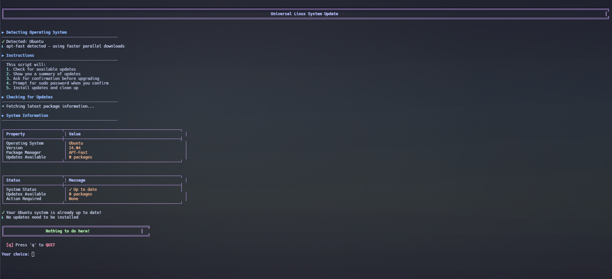

# update-system.sh

[⬆️ Back to Main](../README.md)

A beautiful, universal Linux system update script with a modern Catppuccin dark theme interface.

---

## 📥 Quick Download

```bash
wget https://raw.githubusercontent.com/techytim-tech/Linux-Scripts/main/update-system.sh
chmod +x update-system.sh
./update-system.sh
```

---

## 📸 Screenshot

Click to view full size:

[](../screenshots/update-system-screenshot.png)

*The script showing system information when no updates are available*

---

## ✨ Features

- **Beautiful Catppuccin Mocha Theme** - Modern, eye-pleasing terminal interface with carefully selected colors
- **Multi-Distribution Support** - Works seamlessly on Ubuntu, Debian, Arch Linux, Fedora, and openSUSE Tumbleweed
- **Smart Package Manager Detection** - Automatically detects and uses apt-fast if available on Debian/Ubuntu systems for faster parallel downloads
- **Clear Visual Tables** - Shows system information and available updates in organized, easy-to-read tables
- **Smart Permission Handling** - Detects if running as root or regular user and adjusts prompts accordingly
- **Interactive Prompts** - Clear y/q prompts for user confirmation before making any changes
- **Automatic Cleanup** - Removes unnecessary packages and cleans cache after updates
- **Detailed Update Summary** - Shows all available updates in a table format before proceeding
- **Reboot Notification** - Alerts you if a system reboot is required after updates
- **Live Progress Display** - Real-time output showing package operations as they happen

---

## 🐧 Supported Distributions

| Distribution | Package Manager | Status |
|--------------|----------------|--------|
| Ubuntu | APT / APT-Fast | ✅ Supported |
| Debian | APT / APT-Fast | ✅ Supported |
| Arch Linux | Pacman | ✅ Supported |
| Manjaro | Pacman | ✅ Supported |
| Fedora | DNF | ✅ Supported |
| openSUSE Tumbleweed | Zypper | ✅ Supported |
| openSUSE Leap | Zypper | ✅ Supported |

---

## 🚀 Usage

### Installation

1. **Download the script:**
   ```bash
   wget https://raw.githubusercontent.com/techytim-tech/Linux-Scripts/main/update-system.sh
   ```

2. **Make it executable:**
   ```bash
   chmod +x update-system.sh
   ```

3. **Run the script:**
   ```bash
   ./update-system.sh
   ```

### Running the Script

Simply execute the script - you don't need to run it with sudo initially:

```bash
./update-system.sh
```

The script will:
1. Automatically detect your Linux distribution
2. Show you what it will do
3. Check for available updates
4. Ask for your confirmation (press 'y' to continue or 'q' to quit)
5. Prompt for your sudo password only when you confirm the upgrade

---

## 🔄 How It Works

### Step-by-Step Process

1. **Operating System Detection**
   - Automatically identifies your Linux distribution
   - Selects the appropriate package manager commands
   - Detects apt-fast on Ubuntu/Debian systems for faster downloads

2. **Clear Instructions**
   - Shows you exactly what the script will do
   - No surprises or hidden operations

3. **System Information Display**
   - Displays OS name, version, and package manager in a beautiful table
   - Shows the number of available updates

4. **Update Check**
   - Fetches the latest package information
   - Lists all available updates in an organized table (up to 15 packages shown)
   - If more than 15 updates are available, shows count of remaining packages

5. **User Confirmation**
   - Clear prompt asking: "Do you want to Upgrade the System?"
   - Shows whether you're running as root (no password needed) or regular user (will prompt for password)
   - Press **'y'** to proceed with upgrade
   - Press **'q'** to quit without making any changes

6. **System Upgrade**
   - Only runs after you confirm with 'y'
   - Prompts for sudo password if needed
   - Shows live progress of package installations
   - Color-coded output for easy reading

7. **Automatic Cleanup**
   - Removes unnecessary packages (autoremove)
   - Cleans package cache (autoclean)

8. **Completion & Reboot Check**
   - Shows success message
   - Alerts you if a system reboot is required
   - On Debian-based systems, checks `/var/run/reboot-required`

---

## 🎨 Visual Features

The script includes beautiful visual elements:

### Color Scheme (Catppuccin Mocha)
- 🟢 **Green** - Success messages and confirmations
- 🟡 **Yellow** - Warnings and important notices
- 🔴 **Red** - Errors and quit option
- 🔵 **Blue** - Section headers
- 🟦 **Cyan/Teal** - Status messages
- 🟠 **Peach** - Active operations and package names
- 🟣 **Mauve/Lavender** - Borders and decorative elements

### UI Elements
- **Bordered Boxes** - Important prompts and headers
- **Tables** - System information and package lists
- **Progress Indicators** - Live package operation status
- **Icons** - Visual indicators (✓, ✗, ⚠, ➜, ⟳)

---

## 📋 Requirements

- **Bash shell** - Standard on all Linux distributions
- **sudo privileges** - Unless running as root
- **Internet connection** - Required to download updates
- **Supported distribution** - One of: Ubuntu, Debian, Arch Linux, Manjaro, Fedora, or openSUSE

---

## ⚡ APT-Fast Support

### What is apt-fast?

apt-fast is a shellscript wrapper for apt that can drastically improve download speeds by downloading packages in parallel using multiple connections.

### Automatic Detection

On Ubuntu and Debian systems, the script automatically:
- Checks if apt-fast is installed
- Uses apt-fast if available for faster parallel downloads
- Falls back to regular apt if not installed
- Informs you which tool is being used in the system information table

### Installing apt-fast

To install apt-fast on Ubuntu/Debian:

```bash
sudo add-apt-repository ppa:apt-fast/stable
sudo apt update
sudo apt install apt-fast
```

During installation, you'll be asked to configure:
- Maximum number of connections (recommended: 5-16)
- Whether to suppress apt-fast confirmation dialog

After installation, the update-system.sh script will automatically detect and use apt-fast on subsequent runs.

---

## 🔧 Troubleshooting

### Common Issues

**Q: The script says my OS is unsupported**

A: Currently supported distributions are:
- Ubuntu and Debian (APT-based)
- Arch Linux and Manjaro (Pacman-based)
- Fedora (DNF-based)
- openSUSE Tumbleweed and Leap (Zypper-based)

Make sure you're running one of these distributions. Check with: `cat /etc/os-release`

---

**Q: I'm not being prompted for a password**

A: This is normal if you're running as root. The script detects your user status and will show:
- "Running as root user - No password needed" if you're root
- "Running as regular user - You will be prompted for sudo password" if you're not root

---

**Q: Can I cancel the update after starting the script?**

A: Yes! Before the actual upgrade begins, you'll see a clear prompt:

```
Do you want to Upgrade the System?

[y] Press 'y' to UPGRADE the system
[q] Press 'q' to QUIT without upgrading
```

Pressing **'q'** will exit the script immediately without making any changes to your system.

---

**Q: The script shows 0 updates available but I know there are updates**

A: Try running the package manager's update command manually first:
- Ubuntu/Debian: `sudo apt update`
- Arch: `sudo pacman -Sy`
- Fedora: `sudo dnf check-update`
- openSUSE: `sudo zypper refresh`

If updates still don't appear, check your repository configuration.

---

**Q: Can I run this script in a cron job?**

A: The script is designed for interactive use with user prompts. For automated updates, you should use the package manager's built-in automation features:
- Ubuntu/Debian: `unattended-upgrades`
- Fedora: `dnf-automatic`
- Arch: Consider `pacman-contrib` with custom scripts

---

**Q: Does this script upgrade to a new distribution version?**

A: No, this script only updates packages within your current distribution version. For distribution upgrades:
- Ubuntu/Debian: Use `do-release-upgrade`
- Fedora: Use `dnf system-upgrade`
- Arch: Rolling release (this script handles it)
- openSUSE Tumbleweed: Rolling release (this script handles it)

---

**Q: Why does the script use different commands for different distributions?**

A: Each Linux distribution uses a different package manager with its own commands:
- **APT** (Debian/Ubuntu): `apt update` and `apt upgrade`
- **Pacman** (Arch): `pacman -Sy` and `pacman -Syu`
- **DNF** (Fedora): `dnf check-update` and `dnf upgrade`
- **Zypper** (openSUSE): `zypper refresh` and `zypper update`

The script automatically detects your distribution and uses the correct commands.

---

## 🛡️ Security Considerations

- The script requires sudo privileges to install system updates
- All commands are displayed with full output for transparency
- No automatic execution - user confirmation required before any changes
- Uses official package manager commands only
- No external scripts or downloads during execution

---

## 📝 Examples

### Example Output: System Up to Date

```
╔══════════════════════════════════════════════════════════════╗
║                  Nothing to do here!                         ║
╚══════════════════════════════════════════════════════════════╝

[q] Press 'q' to QUIT
```

### Example Output: Updates Available

```
┌──────────────────────────────────┬──────────────────────────────────┐
│ Property                         │ Value                            │
├──────────────────────────────────┼──────────────────────────────────┤
│ Operating System                 │ Ubuntu                           │
│ Version                          │ 22.04                            │
│ Package Manager                  │ APT-Fast                         │
│ Updates Available                │ 42 packages                      │
└──────────────────────────────────┴──────────────────────────────────┘
```

---

## 🤝 Contributing

Found a bug or want to add support for another distribution? Contributions are welcome!

1. Fork the repository
2. Create your feature branch (`git checkout -b feature/AmazingFeature`)
3. Commit your changes (`git commit -m 'Add some AmazingFeature'`)
4. Push to the branch (`git push origin feature/AmazingFeature`)
5. Open a Pull Request

---

## 📄 License

This script is open source and available under the MIT License.

---

[⬆️ Back to Main](../README.md)